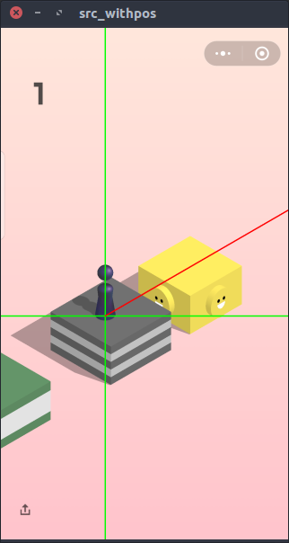
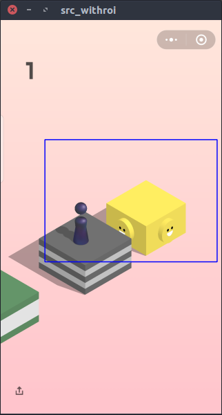
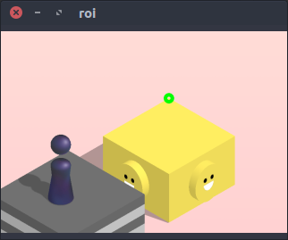
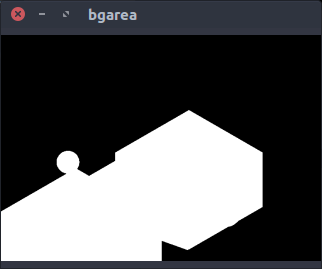

# WeChatAutoJump

## Introduction
A program that can play the WeChat "Little Game" Jump Jump

## Method
1. first identify the little man and his direction to jump, by color match, noticing that the man has different color with all other game elements.

 

 

2. in the ROI, find the top of the next step by removing the background

 

 

## Result

